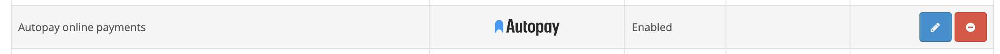

# Instrukcja instalacji oraz obsługi wtyczki „Płatności online Autopay” dla platformy OpenCart

**Moduł przeznaczony jest tylko dla OpenCart w wersji 4.  
W celu pobrania modułu dla wersji 3.x, przejdź [tutaj.](https://github.com/bluepayment-plugin/opencart-plugin)  
W celu pobrania modułu dla wersji 2.3, przejdź [tutaj.](https://github.com/bluepayment-plugin/opencart-2.3-plugin)**

## Podstawowe informacje
Płatności online Autopay to moduł płatności umożliwiający realizację transakcji bezgotówkowych w sklepie opartym na platformie OpenCart. Jeżeli jeszcze nie masz wtyczki, możesz ją pobrać [tutaj.](https://github.com/bluepayment-plugin/opencart-plugin/raw/master/bm.ocmod.zip)

### Główne funkcje

Do najważniejszych funkcji modułu zalicza się:
- realizację płatności online poprzez odpowiednie zbudowanie startu transakcji
- obsługę powiadomień o statusie transakcji (notyfikacje XML)
- obsługę zakupów bez rejestracji w serwisie
- obsługę dwóch trybów działania – testowego i produkcyjnego (dla każdego z nich wymagane są osobne dane kont, po które zwróć się do nas)
- przekierowanie na paywall/bramkę Autopay, gdzie są dostępne wszystkie formy płatności

### Wymagania systemowe
- OpenCart 4.x
- Wersja PHP 8.0 lub wyższa

### Opis zmian

Wersja 1.0.8
- Zmieniliśmy tekst informacji o prowizji w panelu administracyjnym.
- Zmieniliśmy link do oferty regulaminów w panelu administracyjnym.

Wersja 1.0.7
- Poprawiliśmy działanie pobierania kanałów płatniczych dla konfiguracji z wieloma walutami.

Wersja 1.0.6
- Zmieniliśmy nazwę na Autopay

Wersja 1.0.5
- Dodaliśmy obsługę Visa Mobile.
- Ustandaryzowaliśmy tekst **Klucz konfiguracyjny (hash)** (wcześniej _Klucz współdzielony_) w konfiguracji modułu.
- Dodaliśmy informację o aktualnej wersji platformy oraz moduły podczas rozpoczęcia transakcji.

Wersja 1.0.4
- Dodaliśmy komunikat pomocniczy dot. środowiska testowego w panelu administracyjnym.

Wersja 1.0.3
- Dodaliśmy informacje na temat rozpoczęcia przyjmowania płatności w OpenCart.

Wersja 1.0.2
- Poprawiliśmy wyświetlanie strony z konfiguracją modułlu w panelu administracyjnym.
- Dodaliśmy usuwanie białych znaków z ServiceID / SharedKey.

Wersja 1.0.1
- Poprawiliśmy wyliczanie hasha.

Wersja 1.0.0
- Pierwsza wersja dokumentu

## Instalacja modułu
Możesz zainstalować moduł płatności jedną z dwóch metod – automatycznie lub manualnie.

### Instalacja manualna

1. Przejdź do zakładki **Extensions ➝ Installer**
2. Za pomocą formularza **załaduj plik z modułem**, a następnie wyślij formularz.
3. Przejdź do punktu Aktywacja modułu

## Aktywacja

1. Przejdź do zakładki **Extensions > Extensions**
2. Z listy rozwijanej wybierz **Payments**
3. Wyszukaj moduł **Płatności online Autopay**, zainstaluj ją, a następnie przejdź do konfiguracji modułu.

*Widok modułu w zakładce "Rozszerzenia"*

## Konfiguracja modułu

### Konfiguracja podstawowych pól wtyczki

1. W sekcji **Włącz/Wyłącz** decydujesz czy kanał płatności będzie widoczny podczas składania zamówienia.

2. **Użyj środowiska testowego** – wybierając opcję **TAK**, sprawisz, że wszystkie płatności będą przekierowywane na testową bramkę płatniczą, która znajduje się pod adresem https://testportal.autopay.eu/. Jeżeli tego nie zrobisz, automatycznie zostanie ustawiona produkcyjna wersja bramki płatniczej, a wszystkie płatności zostaną przekierowane na adres https://portal.autopay.eu/.

Jeżeli wybierzesz środowisko testowe, moduł nie będzie przetwarzał żadnych faktycznych płatności.

3. **Status oczekiwania na płatność** – wybrany status zostanie ustawiony dla nowego zamówienia.

4. **Status prawidłowej płatności** – wybrany status zostanie ustawiony dla zamówienia, które zostało prawidłowo opłacone.

5. **Status nieprawidłowej płatności** – wybrany status zostanie ustawiony dla zamówienia, które nie zostało prawidłowo opłacone.

6. Po uzupełnieniu wszystkich pól – wciśnij: **Zapisz zmiany** i gotowe.

*Widok konfiguracji modułu*

### Konfiguracja sekcji Ustawienia walut

Żeby wyświetlić waluty – zdefiniuj je w zakładce **System ➝ Localisation ➝ Currencies**

**Pola wspólne dla wszystkich walut:**

1. **Identyfikator serwisu partnera** – ma wartość liczbową i jest unikalny dla każdego sklepu (otrzymasz go od Autopay).

2. **Klucz konfiguracyjny (hash)** – unikalny klucz przypisany do danego sklepu (otrzymasz go od Autopay).

*Przykładowy wygląd ustawień poszczególnych walut*

### Konfiguracja adresów URL

Upewnij się, że w panelach administracyjnych Autopay https://portal.autopay.eu/ oraz https://testportal.autopay.eu/ poniższe pola zawierają poprawne adresy sklepu.

- Konfiguracja adresu powrotu po płatności

https://domena-sklepu.pl/index.php?route=extension/bluepayment/payment/bluepayment.paymentReturn

- Konfiguracja adresu, na który jest wysyłany ITN

https://domena-sklepu.pl/index.php?route=extension/bluepayment/payment/bluepayment.processItn

## Logi

1. Przejdź do zakładki **Konfiguracja modułu > Logi**.

2. Użyj rozwijanej listy, a znajdziesz tam pliki z podziałem na dni, tworzone według wzoru **bluepayment-YYYY-MM-DD.log**

Pliki te zawierają logi błędów, które mogą wystąpić podczas procesu płatności. W plikach dostępne są również informacje dotyczące każdej wykonanej płatności za pomocą wtyczki Płatności online Autopay.

Dane te mogą się okazać przydatne przy zgłaszaniu problemów z działaniem wtyczki.

*Zakładka z logami - przykładowy widok*

